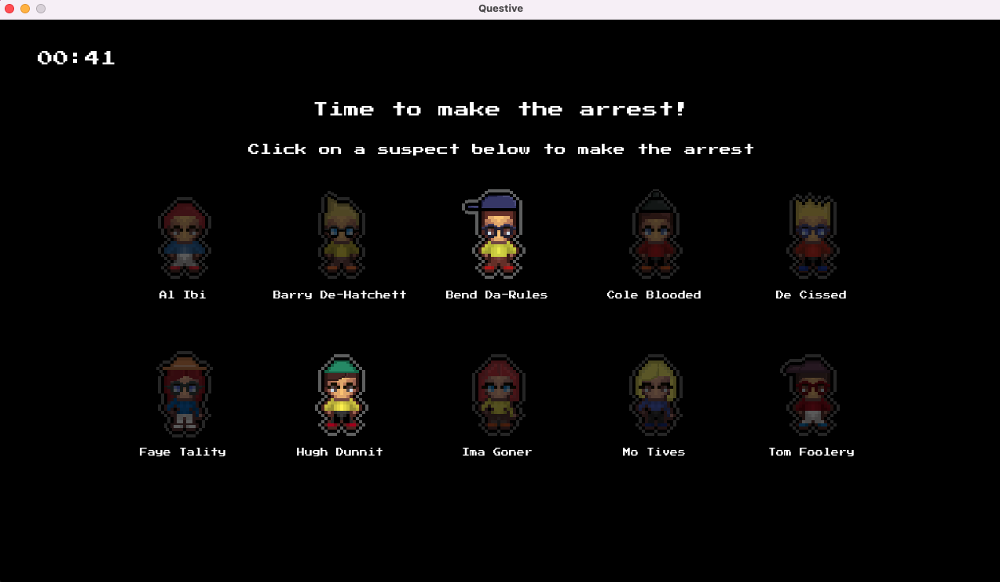
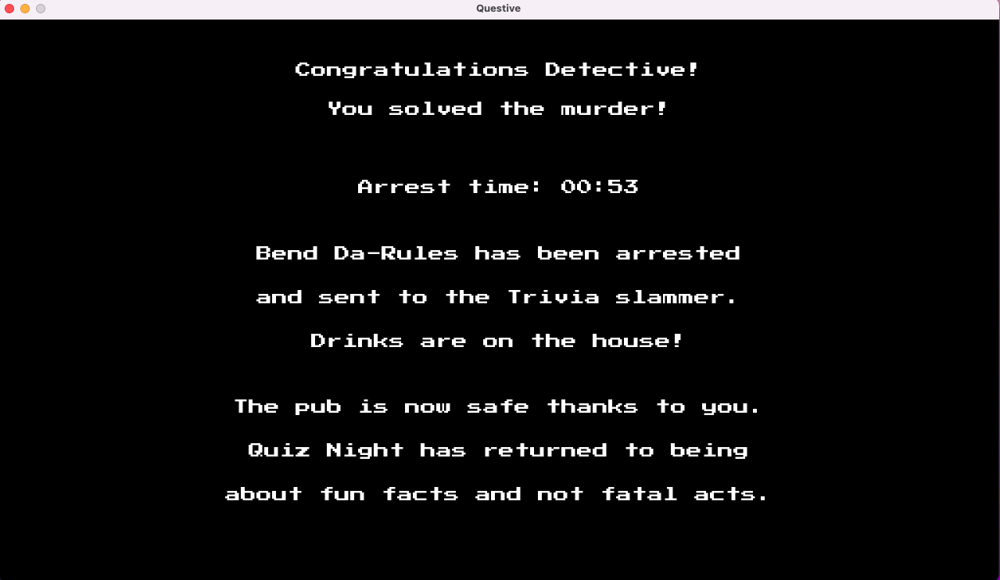

# **Questive Group Project**

***
### 🔎  Team:

+ Gwen Michailidis
+ Melanie Clark

***

### 🔎  Game Overview:

Questive is a trivia based game.

Set in a pub in Trivia Hollow, the aim of the game is to find who murdered the Quizmaster by answering questions and
getting clues to help eliminate suspects.

### 🔎  Game screenshots

<table bgcolor="#00000F">
    <tbody>
        <tr>	
            <th>Main menu</th>
            <th>Instructions</th></tr>
        <tr>         
            <td></td>
            <td></td></tr>
        <tr>	
            <th>Question screen</th>
            <th>Wrong answer</th></tr>
        <tr>         
            <td></td>
            <td></td></tr>
        <tr>
            <th>Correct answer</th>
            <th>Arrest suspect</th></tr>            
        <tr>
            <td></td>
            <td></td></tr>
        <tr>
            <th>Game over (Lost)</th>
            <th>Game over (Won)</th></tr>            
        <tr>
            <td></td>
            <td></td></tr>
</tbody></table>

***
### 🔎  How to Run Questive:

1. Create SQL database using `db/db_utils/questive_db_sql`
2. Execute `db/db_utils/questive_db_sql` file
3. Install required dependencies - 'pip install -r requirements.txt'
4. Run the game file `main.py`
5. Good luck finding the murderer!

***
### 🔎  Gameplay Mechanics:
Questive uses mouse control throughout the game.

### 🔎  Music credit:
Music from #Uppbeat (free for Creators!):
https://uppbeat.io/t/v-draganov/mystery-box
License code: IP7WRZ6A0WKFINSG

